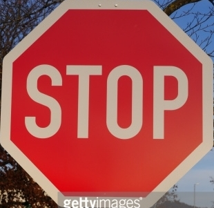
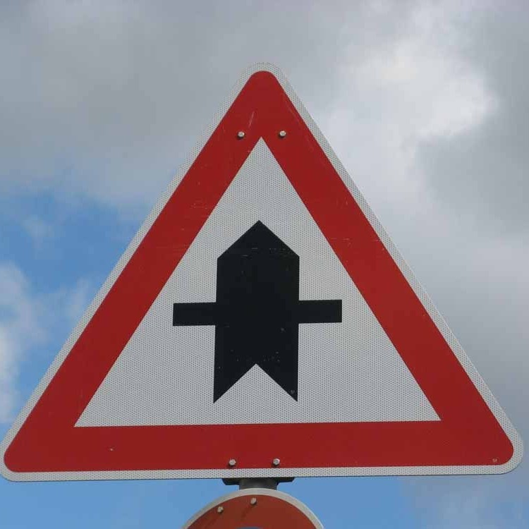
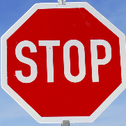
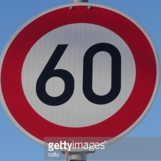
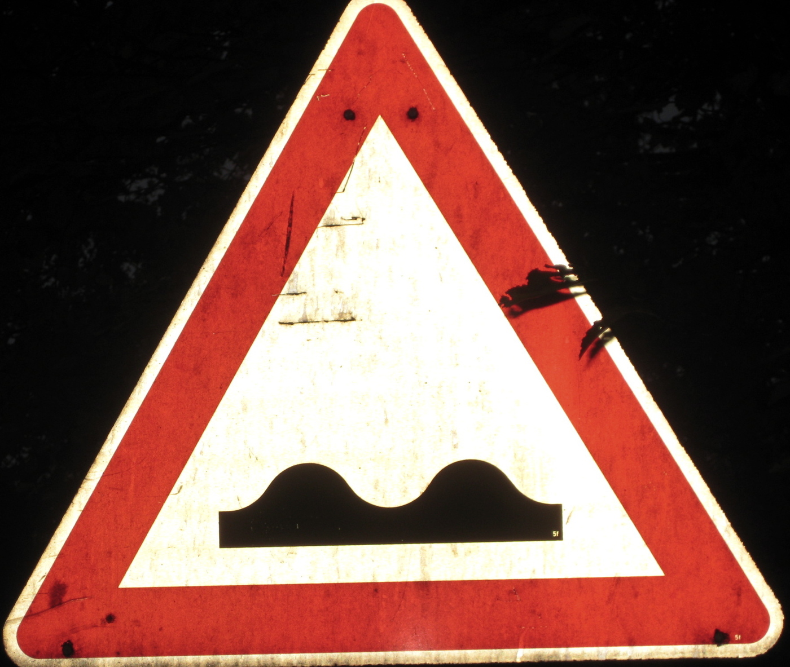
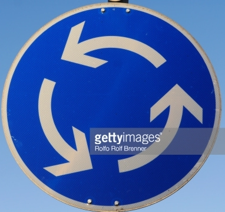
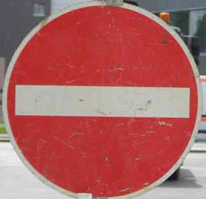

# **Traffic Sign Recognition Project**

---

**Build a Traffic Sign Recognition Project**

The goals / steps of this project are the following:
* Load the data set
* Explore, summarize and visualize the data set
* Design, train and test a model architecture
* Use the model to make predictions on new images
* Analyze the softmax probabilities of the new images
* Summarize the results with this written report

[//]: # (Image References)

[image1]: ./images/image1_data_exploration.png "Data Exploration"
[image1.1]: ./images/image1_data_exploration.png "Data Exploration"

## Rubric Points
### Here I will consider the [rubric points](https://review.udacity.com/#!/rubrics/481/view) individually and describe how I addressed each point in my implementation.  

---
### Writeup / README

#### 1. Provide a Writeup / README that includes all the rubric points and how you addressed each one. You can submit your writeup as markdown or pdf. You can use this template as a guide for writing the report. The submission includes the project code.

You're reading it! and here is a link to my [project code](https://github.com/patriciapampanelli/CarND-Traffic-Sign-Classifier-Project/blob/master/Traffic_Sign_Classifier.ipynb)

### **Data Set Summary & Exploration**

#### **1. Provide a basic summary of the data set. In the code, the analysis should be done using python, numpy and/or pandas methods rather than hardcoding results manually.**

I used the numpy library to calculate summary statistics of the traffic
signs data set:

* The size of training set is 34799
* The size of the validation set is 4410
* The size of test set is 12630
* The shape of a traffic sign image is (32, 32, 3)
* The number of unique classes/labels in the data set is 43

#### **2. Include an exploratory visualization of the dataset.**

***First image of each class:***

![Data Exploration][image1]

***Second image of each class:***

![Data Exploration][image1.1]

### **Design and Test a Model Architecture**

#### **1. Describe how you preprocessed the image data. What techniques were chosen and why did you choose these techniques? Consider including images showing the output of each preprocessing technique. Pre-processing refers to techniques such as converting to grayscale, normalization, etc. (OPTIONAL: As described in the "Stand Out Suggestions" part of the rubric, if you generated additional data for training, describe why you decided to generate additional data, how you generated the data, and provide example images of the additional data. Then describe the characteristics of the augmented training set like number of images in the set, number of images for each class, etc.)**

I decided experiment these preprocessing techniques that are very common in classification problems.

- Preprocessing steps used in the final solution:
	- Contrast Limited Adaptive Histogram Equalization (CLAHE) (it is not used in the final solution)
	    - [skimage.exposure.equalize_adapthist](http://scikit-image.org/docs/dev/api/skimage.exposure.html#skimage.exposure.equalize_adapthist)

- *Other images processing techniques not used in the final solution*:
	- Contrast Limited Adaptive Histogram Equalization (CLAHE) (it is not used in the final solution)
	    - [skimage.exposure.equalize_adapthist](http://scikit-image.org/docs/dev/api/skimage.exposure.html#skimage.exposure.equalize_adapthist)
	- Converts input images from RGB to Grayscale using TensorFlow
		- [tf.image.rgb_to_grayscale](https://www.tensorflow.org/versions/r1.2/api_docs/python/tf/image/rgb_to_grayscale)
	- Median filter:
		- [skimage.filters.rank.median](http://scikit-image.org/docs/dev/api/skimage.filters.rank.html#skimage.filters.rank.median)
	- Normalize images
	- Performs Gamma Correction on the image using TensorFlow
		- [tf.image.adjust_gamma](https://www.tensorflow.org/api_docs/python/tf/image/adjust_gamma) 
		- Parameters:
		    - gamma = 0.9
		    - gain = 1
	

#### **2. Describe what your final model architecture looks like including model type, layers, layer sizes, connectivity, etc.) Consider including a diagram and/or table describing the final model.**

My final model consisted of the following layers:

| Layer         		|     Description	        					| 
|:---------------------:|:---------------------------------------------:| 
| Input         		| 32x32x1 Gray scale image   					| 
| Convolution 5x5     	| 1x1 stride, valid padding						|
| RELU					|												|
| Max pooling	      	| 2x2 stride  					 				|
| Convolution 5x5	    | 1x1 stride, valid padding      				|
| RELU					|												|
| Max pooling	      	| 2x2 stride  					 				|
| Flatten				|												|
| Fully connected		| Input 400, Output 120   						|
| RELU					|												|
| Fully connected		| Input 120, Output 84   						|
| RELU					|												|
| Fully connected		| Input 84, Output 43   						|
 
It is important to say that I tried to include dropout layers between convolutional layers and fully connected layers. I tried this strategy in order to prevent overfitting, but no improvement was obtained with respect to accuracy of the testing set.

#### 3. Describe how you trained your model. The discussion can include the type of optimizer, the batch size, number of epochs and any hyperparameters such as learning rate.

I decided to used an exponential decay during the training process. That's because the learning rate tends to be more effective if it's higher at the first steps and, then, goes down as the neural network learns. I used:

[tf.train.exponential_decay](https://www.tensorflow.org/api_docs/python/tf/train/exponential_decay)
Parameters:
	- learning_rate = 0.001
	- num_examples = 34799
	- decay_steps = 50*num_examples/BATCH_SIZE
	- decay_rate = 0.1
	- staircase = True

These are the others hyperparameters:

	- EPOCHS = 50
	- BATCH_SIZE = 128

#### 4. Describe the approach taken for finding a solution and getting the validation set accuracy to be at least 0.93. Include in the discussion the results on the training, validation and test sets and where in the code these were calculated. Your approach may have been an iterative process, in which case, outline the steps you took to get to the final solution and why you chose those steps. Perhaps your solution involved an already well known implementation or architecture. In this case, discuss why you think the architecture is suitable for the current problem.

My final model results were:
* training set accuracy of 1.000
* validation set accuracy of 0.961
* test set accuracy of 0.944

I tried an iterative approach until de desirable validation accuracy was obtanied. First a tried to modified the model architecture varying the number os neurons of the fully connected layers:

    - Fully connected: Input 400, Output 120
    - RELU
    - Fully connected: Input 120, Output 84
    - RELU
    - Fully connected: Input 84, Output 43

This model didn't improved the validation accuracy. Looking at the validation accuracy I relized that the model is overfitted. Then I tried to add dropout layers after the convolutional and the fully connected layers:

- Input: 32x32x1
- Convolution: 5x5, 1x1 stride, valid padding
- RELU
- Max pooling: 2x2 stride
- Dropout: 0.9
- Convolution: 5x5, 1x1 stride, valid padding
- RELU
- Max pooling: 2x2 stride
- Dropout: 0.9 
- Flatten
- Fully connected: Input 400, Output 120
- RELU
- Dropout: 0.9
- Fully connected: Input 120, Output 84
- RELU
- Dropout: 0.9
- Fully connected: Input 84, Output 43

Finally, with no significant improvements I decided to modified the training learning rate using an exponential decay:

*starter_learning_rate = 0.001*
*EPOCHS = 200*
*BATCH_SIZE = 128*
*num_examples = len(X_train)*
*global_step = tf.Variable(0, trainable=False)*
*learning_rate = tf.train.exponential_decay(starter_learning_rate, global_step, 50*num_examples/BATCH_SIZE, 0.1, staircase=True)*

This approach improved the model and I decided to finish the project with that. It makes sense since as the network learns the learning rate should be lower.

### Test a Model on New Images

#### 1. Choose five German traffic signs found on the web and provide them in the report. For each image, discuss what quality or qualities might be difficult to classify.

I used these images in order to evaluate the proposed model:

         

**TODO**

#### 2. Discuss the model's predictions on these new traffic signs and compare the results to predicting on the test set. At a minimum, discuss what the predictions were, the accuracy on these new predictions, and compare the accuracy to the accuracy on the test set (OPTIONAL: Discuss the results in more detail as described in the "Stand Out Suggestions" part of the rubric).

Here are the results of the prediction:
				 											
| Image			        |     Prediction	        					|      Correct?	        					| 
|:---------------------:|:---------------------------------------------:| 
| Stop      |    		Stop						|  Y |
| Bumpy road	| 	Bumpy road	|  Y |
| Right-of-way at the next intersection |	Right-of-way at the next intersection|   Y |
| Road work			|   Road work	|   Y |
| Stop			|   Speed limit (50km/h)  |   N |
| Speed limit (60km/h)		|   Speed limit (60km/h)	|  Y |
| Bumpy road	|   	Bumpy road	|   Y |
| Roundabout mandatory	|      End of no passing by vehicles over 3.5 metric tons	| N |
| No entry			|      No entry	|  Y |
| Children crossing    	|  	Children crossing	| Y |

The model was able to correctly guess 8 of the 10 traffic signs, which gives an accuracy of 80%. This is lower then we obtained for the testing set but I considered a good result. It can be improved with others techniques like image augmentation.

#### 3. Describe how certain the model is when predicting on each of the five new images by looking at the softmax probabilities for each prediction. Provide the top 5 softmax probabilities for each image along with the sign type of each probability. (OPTIONAL: as described in the "Stand Out Suggestions" part of the rubric, visualizations can also be provided such as bar charts)

The code for making predictions on my final model is located in the 19th cell of the Ipython 

**For the first image**, the model is absolutely sure that this is a stop sign (probability of 1.0), and the image does contain a stop sign. The top five soft max probabilities were:

Stop: 100.00%
Speed limit (20km/h): 0.00%
Speed limit (30km/h): 0.00%
Speed limit (50km/h): 0.00%
Speed limit (60km/h): 0.00%

**For the second image**:

Bumpy road: 100.00%
Speed limit (20km/h): 0.00%
Speed limit (30km/h): 0.00%
Speed limit (50km/h): 0.00%
Speed limit (60km/h): 0.00%

**For the third image**:

Right-of-way at the next intersection: 100.00%
Speed limit (20km/h): 0.00%
Speed limit (30km/h): 0.00%
Speed limit (50km/h): 0.00%
Speed limit (60km/h): 0.00%

**For the forth image**:

Road work: 100.00%
Speed limit (20km/h): 0.00%
Speed limit (30km/h): 0.00%
Speed limit (50km/h): 0.00%
Speed limit (60km/h): 0.00%

**For the fifth image**:

Speed limit (50km/h): 100.00%
Speed limit (20km/h): 0.00%
Speed limit (30km/h): 0.00%
Speed limit (60km/h): 0.00%
Speed limit (70km/h): 0.00%

**For the sixth image**:

Speed limit (60km/h): 100.00%
Speed limit (20km/h): 0.00%
Speed limit (30km/h): 0.00%
Speed limit (50km/h): 0.00%
Speed limit (70km/h): 0.00%

**For the seventh image**:

Bumpy road: 100.00%
Speed limit (20km/h): 0.00%
Speed limit (30km/h): 0.00%
Speed limit (50km/h): 0.00%
Speed limit (60km/h): 0.00%

**For the eighth image**:

End of no passing by vehicles over 3.5 metric tons: 100.00%
Speed limit (20km/h): 0.00%
Speed limit (30km/h): 0.00%
Speed limit (50km/h): 0.00%
Speed limit (60km/h): 0.00%

**For the ninth image**:

No entry: 100.00%
Speed limit (20km/h): 0.00%
Speed limit (30km/h): 0.00%
Speed limit (50km/h): 0.00%
Speed limit (60km/h): 0.00%

**For the tenth image**:

Children crossing: 100.00%
Speed limit (20km/h): 0.00%
Speed limit (30km/h): 0.00%
Speed limit (50km/h): 0.00%
Speed limit (60km/h): 0.00%

The model seems to be confusing the speed limit plates with the other plates. There are many explanations for these results. The dataset is not balanced and there are more plates of this type than the others. Another explanation is that the model is overfitting. Despite that, the model hit 80% of the images.
